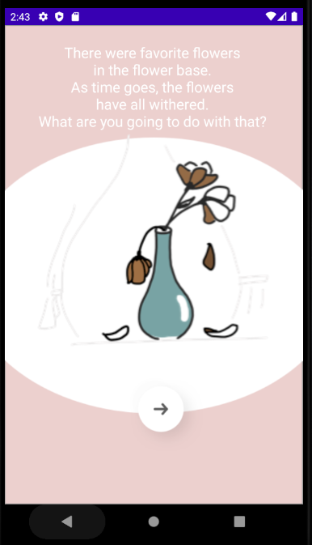
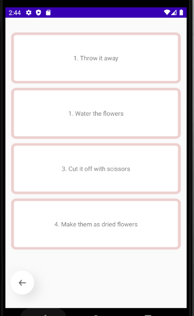
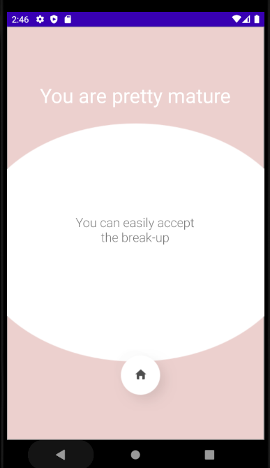

# Android Study 용 Git

`Android` `Kotlin`

------

- LoveTest : 

  `Java` `Send Email` `Java Mail Api`

  -> 인증 성공 시 Dialog Down

  - 참조 

     https://www.youtube.com/watch?v=M1e2tLnzVPo&t=3154s
  
  
  
  
  

------

- MyVolley : Volley를 이용한 간단한 영화 정보를 불러와서 Gson을 이용 parsing 하는 예제

  `Java` `Boostcourse` `Volley` `Gson`

  - Boost Course 5 Example
  
    https://www.edwith.org/boostcourse-android/lecture/17091/

---

