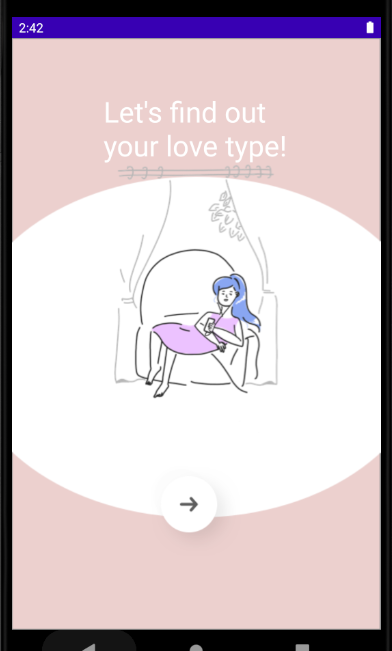

# Android Study 용 Git

`Android` `Kotlin`

------

- LoveTest : 

  `jetpack' 'navigationCompnent'

  -> 하나의 네비게이션을 두고 여러개의 프레그먼트 이용 

  - 참조 

     https://www.youtube.com/watch?v=M1e2tLnzVPo&t=3154s
     
  
  
  
  

------

- textviewKt : 

  - 홍드로이드 
  
    https://www.youtube.com/watch?v=IaXhn_I_ziY&list=PLC51MBz7PMywN2GJ53aF0UO5fnHGjW35a

---

- Intent : 

  - 홍드로이드 
  
    https://www.youtube.com/watch?v=oXIeBhV06-Y&list=PLC51MBz7PMywN2GJ53aF0UO5fnHGjW35a&index=3

---

- ImageViewKt : 

  - 홍드로이드 
  
    https://www.youtube.com/watch?v=fmiwEfFrjsM&list=PLC51MBz7PMywN2GJ53aF0UO5fnHGjW35a&index=4

---
- ListViewKt : 

  - 홍드로이드 
  
    https://www.youtube.com/watch?v=ao0Iqfhy0oo&list=PLC51MBz7PMywN2GJ53aF0UO5fnHGjW35a&index=5

---
